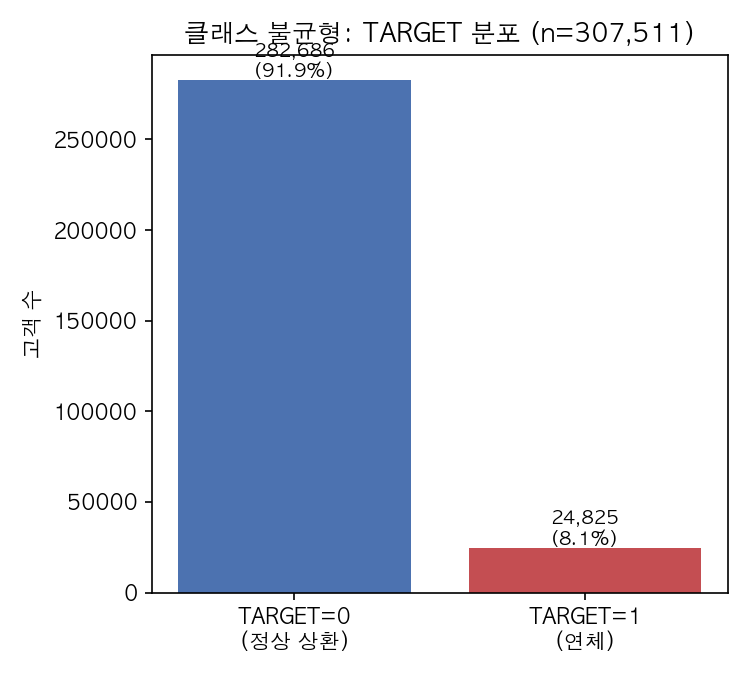
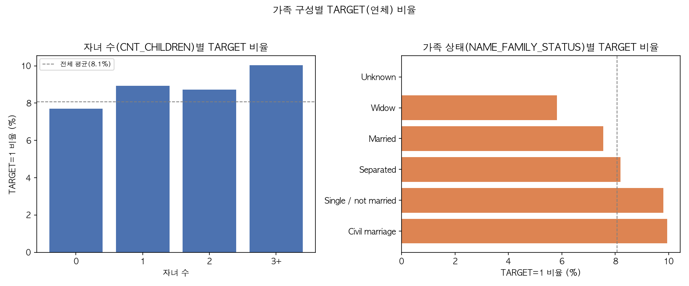
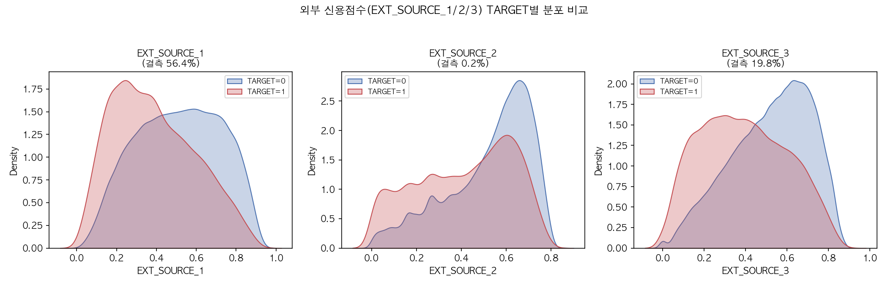
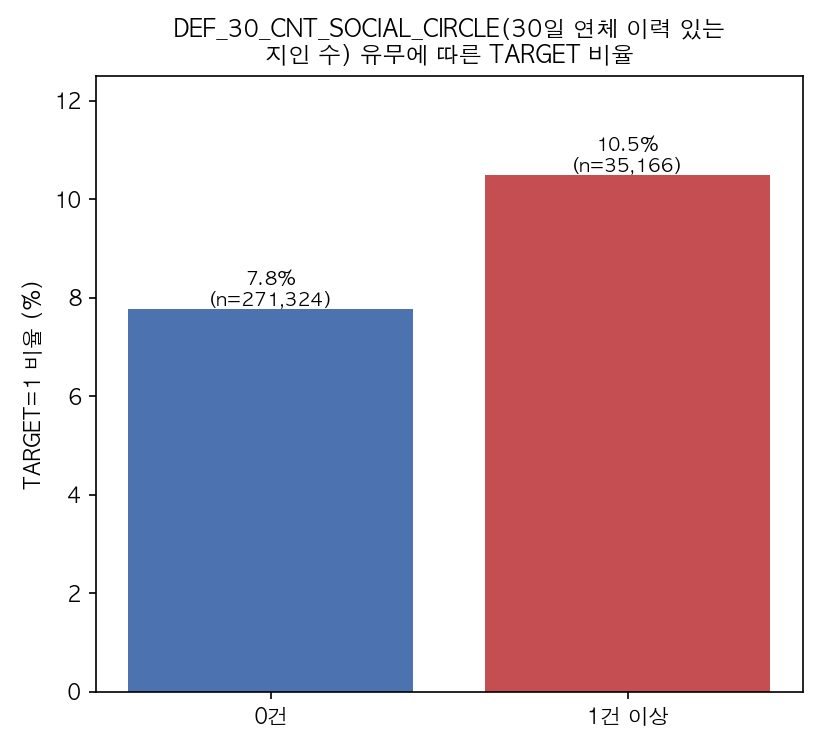
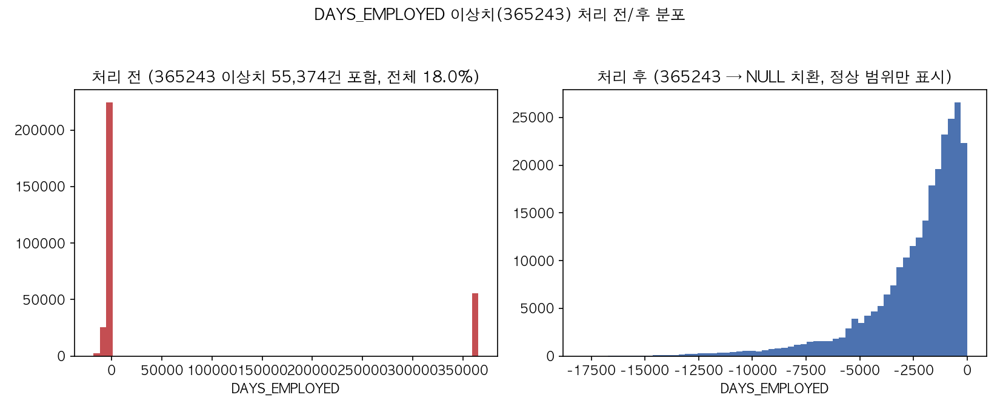
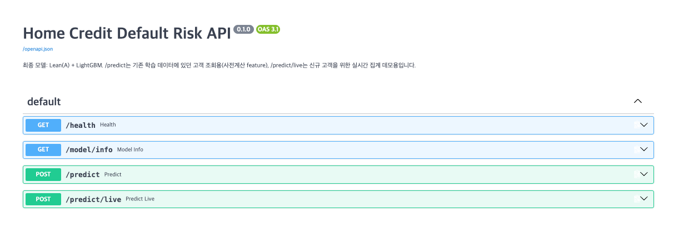
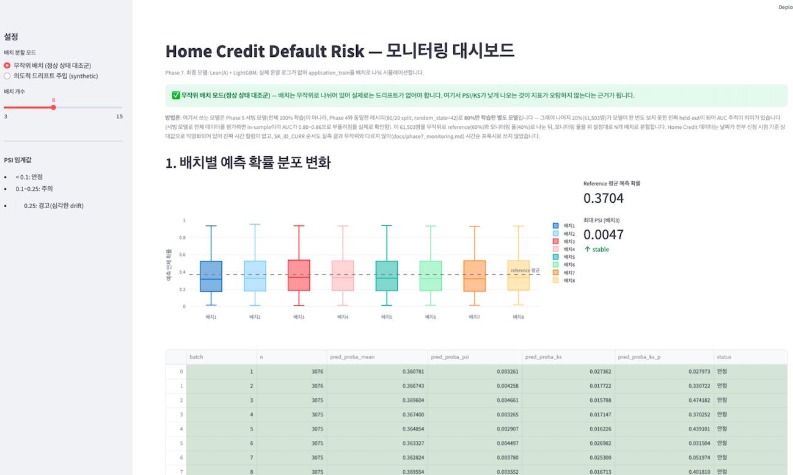
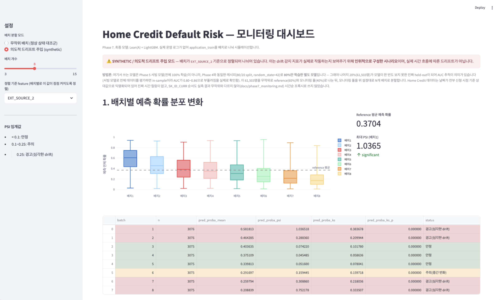

# Home Credit Default Risk

[](https://github.com/dan980918-coder/home-credit-default-risk/actions/workflows/ci.yml)

> Kaggle "Home Credit Default Risk" 데이터로 대출 채무불이행 가능성을 예측하는 모델을 구축했습니다. 신용이력 중심으로 설계한 Lean(A) feature 세트에 LightGBM을 적용한 모델이 12개 모델·데이터셋 조합 중 최고 성능(검증 AUC **0.7825**)을 기록해 최종 채택됐습니다. FastAPI 서빙, Docker 패키징, AWS EC2 배포, Streamlit 기반 드리프트 모니터링까지 구현했습니다.

## 1. 개요

대출 신청자의 신청 정보와 상환 이력으로부터 채무불이행(연체) 가능성을 예측하는 신용평가 모델을 구축했습니다. 데이터는 Kaggle "Home Credit Default Risk"(2018)를 사용했습니다. 최종 모델은 **Lean(A) feature + LightGBM**이며, 80/20 stratified split 기준 검증 AUC **0.7825**를 기록했습니다.

## 2. 데이터

Kaggle "Home Credit Default Risk"(2018) — 단일 파일이 아니라 8개 CSV가 `SK_ID_CURR`(고객·신청 단위 키) 중심으로 연결된 다중 테이블(관계형) 구조입니다.

| 테이블 | 내용 | 행 수 | 컬럼 수 | 키 |
|---|---|---|---|---|
| `application_train.csv` | 대출 신청 정보 + 정답 라벨(`TARGET`) | 307,511 | 122 | `SK_ID_CURR` (PK) |
| `application_test.csv` | 대출 신청 정보 (라벨 없음) | 48,744 | 121 | `SK_ID_CURR` (PK) |
| `bureau.csv` | 타 금융기관에 보고된 과거/현재 신용 이력 | 1,716,428 | 17 | `SK_ID_CURR` → 연결, `SK_ID_BUREAU` (PK) |
| `bureau_balance.csv` | `bureau`의 월별 잔액 스냅샷 | 27,299,925 | 3 | `SK_ID_BUREAU` → 연결 |
| `previous_application.csv` | Home Credit 자체 과거 대출 신청 이력 | 1,670,214 | 37 | `SK_ID_CURR` → 연결, `SK_ID_PREV` (PK) |
| `credit_card_balance.csv` | 과거 Home Credit 신용카드의 월별 잔액 | 3,840,312 | 23 | `SK_ID_PREV` → 연결 |
| `POS_CASH_balance.csv` | 과거 POS/현금 대출의 월별 상태 | 10,001,358 | 8 | `SK_ID_PREV` → 연결 |
| `installments_payments.csv` | 과거 대출 상환 이력(예정 대비 실제) | 13,605,401 | 8 | `SK_ID_PREV` → 연결 |

### 데이터가 담고 있는 정보

`application_train.csv`(122컬럼)가 담고 있는 정보는 크게 아래 카테고리로 묶입니다 (전체 컬럼별 dtype·결측률·분포는 [docs/data_dictionary.md](docs/data_dictionary.md) 참고):

| 카테고리 | 담고 있는 정보 | 대표 컬럼 예시 |
|---|---|---|
| 인구통계/가족구성 | 성별, 자녀 수, 가족 형태, 나이, 학력, 거주 형태 | `CODE_GENDER`, `CNT_CHILDREN`, `NAME_FAMILY_STATUS`, `DAYS_BIRTH`, `NAME_EDUCATION_TYPE`, `NAME_HOUSING_TYPE` |
| 소득/대출조건 | 연소득, 신청 대출 금액·유형, 연금(할부금), 상품 가격, 자산 보유 여부 | `AMT_INCOME_TOTAL`, `AMT_CREDIT`, `NAME_CONTRACT_TYPE`, `AMT_ANNUITY`, `FLAG_OWN_CAR`, `FLAG_OWN_REALTY` |
| 고용/재직 | 직업, 재직일수, 근무처 업종 | `OCCUPATION_TYPE`, `DAYS_EMPLOYED`, `ORGANIZATION_TYPE` |
| 외부 신용점수 | 외부 기관이 산출한 정규화 신용점수 3종 | `EXT_SOURCE_1`, `EXT_SOURCE_2`, `EXT_SOURCE_3` |
| 거주지 특성(건물정보) | 아파트/공용면적, 엘리베이터, 벽 재질 등 거주 건물 관련 지표 — 동일 속성이 평균(`_AVG`)/최빈값(`_MODE`)/중앙값(`_MEDI`) 3개 버전으로 반복돼, 47개 컬럼이지만 실질적으로 독립적인 속성은 14~18개 정도 | `APARTMENTS_AVG/MODE/MEDI`, `ELEVATORS_AVG/MODE/MEDI`, `WALLSMATERIAL_MODE` |
| 신용조회 이력 | 최근 시간/일/주/월/분기/년 단위로 신용조회국에 조회된 횟수 | `AMT_REQ_CREDIT_BUREAU_HOUR/DAY/WEEK/MON/QRT/YEAR` |
| 사회관계망 | 신청자 지인 중 30일/60일 연체 이력이 있는 사람 수 | `OBS_30_CNT_SOCIAL_CIRCLE`, `DEF_30_CNT_SOCIAL_CIRCLE`, `DEF_60_CNT_SOCIAL_CIRCLE` |
| 기타 부가정보 | 제출 서류 여부(20종), 신청 요일/시각, 거주지-근무지 일치 여부 플래그 등 | `FLAG_DOCUMENT_3`, `WEEKDAY_APPR_PROCESS_START`, `REG_CITY_NOT_WORK_CITY` |

**하위 7개 테이블이 담고 있는 정보**:

- **application_test.csv**: `application_train`과 동일한 구조지만 `TARGET`(정답 라벨)이 없는 대출 신청 정보입니다. 원래 Kaggle 대회에서 제출용 예측 대상이었던 세트입니다.
- **bureau.csv**: 신청자가 Home Credit 외 다른 금융기관에 보고한 과거/현재 신용 계좌 이력입니다. 계좌 활성 여부(`CREDIT_ACTIVE`), 신용한도·부채 잔액(`AMT_CREDIT_SUM`/`AMT_CREDIT_SUM_DEBT`), 신용 종류(`CREDIT_TYPE`) 등을 담고 있으며, 한 신청자가 여러 계좌를 가질 수 있어 SK_ID_CURR 기준 다대일 관계입니다.
- **bureau_balance.csv**: `bureau`의 각 신용 계좌를 월 단위로 쪼갠 상태 스냅샷입니다. 매월 연체 심각도(`STATUS`: 0~5, C=완납, X=미상)를 기록해 상환 이력의 시계열 패턴을 담고 있습니다.
- **previous_application.csv**: 신청자가 과거 Home Credit에 냈던 대출 신청 이력입니다. 신청/승인 금액(`AMT_APPLICATION`/`AMT_CREDIT`), 승인 여부(`NAME_CONTRACT_STATUS`), 신청 시점(`DAYS_DECISION`) 등을 담고 있습니다.
- **credit_card_balance.csv**: 과거 Home Credit 신용카드 상품의 월별 잔액 스냅샷입니다. 잔액(`AMT_BALANCE`), 한도(`AMT_CREDIT_LIMIT_ACTUAL`), 연체일수(`SK_DPD`) 등 카드 이용 패턴을 담고 있습니다.
- **POS_CASH_balance.csv**: 과거 POS(할부)/현금 대출 상품의 월별 상태입니다. 남은 할부 개월 수(`CNT_INSTALMENT_FUTURE`), 연체일수(`SK_DPD`) 등을 담고 있습니다.
- **installments_payments.csv**: 과거 대출 상환 이력입니다. 예정 상환일·금액(`DAYS_INSTALMENT`/`AMT_INSTALMENT`)과 실제 납부일·금액(`DAYS_ENTRY_PAYMENT`/`AMT_PAYMENT`)을 나란히 담아 연체·과소납부 여부를 계산할 수 있습니다.

**조인 구조**: `application_train/test`(SK_ID_CURR) ← `bureau`(SK_ID_CURR) ← `bureau_balance`(SK_ID_BUREAU) / `application_train/test` ← `previous_application`(SK_ID_CURR, SK_ID_PREV 발급) ← `credit_card_balance`·`POS_CASH_balance`·`installments_payments`(SK_ID_PREV). SK_ID_CURR이 최상위 키이고, SK_ID_PREV/SK_ID_BUREAU는 하위 이력 테이블을 연결하는 중간 키입니다.

조인 무결성을 검증한 결과 SK_ID_CURR 레벨(최상위)은 고아 레코드 0건으로 완전히 깨끗했지만, 하위 이력 테이블에서는 SK_ID_BUREAU/SK_ID_PREV 기준 고아 레코드가 발견됐습니다 — `bureau_balance` 11.4%, `credit_card_balance` 28.2%, `POS_CASH_balance` 3.4%, `installments_payments` 9.2%. 이 레코드들은 SK_ID_CURR로 연결할 방법이 없어 최종 feature 테이블 구축 시 자연스럽게 제외됩니다.

**데이터 자체의 알려진 제약**: Kaggle 공식 컬럼 설명(`HomeCredit_columns_description.csv`)에는 `AMT_INCOME_TOTAL`, `AMT_CREDIT` 등 금액 컬럼의 화폐 단위가 명시돼 있지 않고, `EXT_SOURCE_1/2/3`도 "Normalized score from external data source"라고만 돼 있을 뿐 어떤 기관의 점수인지는 밝혀져 있지 않습니다. 전체 339개 컬럼의 통계 요약은 [docs/data_dictionary.md](docs/data_dictionary.md)에서 확인할 수 있습니다.

이전 AMEX 기반 버전은 [archive/amex/README.md](archive/amex/README.md)에 보존돼 있습니다.

## 3. EDA 핵심 발견

- **클래스 불균형**: TARGET=0(정상) 91.9% : TARGET=1(연체) 8.1%, 약 11.4:1이었습니다. 단순 accuracy는 의미가 없어 AUC 중심으로 평가했습니다.

  

  TARGET=1(연체) 비율이 8.1%로 소수 클래스입니다. 이후 모델링에서 `class_weight`/`scale_pos_weight`로 불균형에 대응했습니다.

- **결측-TARGET 연관성은 약함**: application_train 120개 feature 컬럼 중 41개가 50%+ 결측(최대 69.9%, 대부분 건물/주거 특성 관련이고 `_AVG/_MODE/_MEDI` 중복 포함)이었지만, phi 계수가 전부 0.041 이하로 매우 작아 결측 자체가 위험 신호는 아닌 것으로 판단했습니다.

- **가족 구성별 TARGET 비율**: 자녀 수가 많을수록(0명 7.7% → 3명 이상 10.0%), 그리고 미혼/사실혼일수록(`Civil marriage` 9.9%, `Single / not married` 9.8%) TARGET 비율이 전체 평균(8.1%)보다 높았고, 기혼(`Married` 7.6%)·사별(`Widow` 5.8%)은 낮았습니다.

  

  자녀 수·가족 상태 모두 TARGET 비율에 완만한 차이를 만들지만, 그 폭은 크지 않습니다(대략 6~10% 범위).

- **외부 신용점수(EXT_SOURCE) 분포**: `EXT_SOURCE_1/2/3` 모두 TARGET=1(연체) 그룹의 분포가 TARGET=0보다 왼쪽(낮은 점수)으로 뚜렷하게 치우쳐 있어, 육안으로도 판별력이 확인됩니다. 결측률은 `EXT_SOURCE_1` 56.4%, `EXT_SOURCE_2` 0.2%, `EXT_SOURCE_3` 19.8%로 컬럼별 편차가 컸습니다.

  

  세 점수 모두 TARGET=0/1 분포가 겹치긴 하지만 갈라져 있고, 이 시각적 판별력은 이후 SHAP 분석에서 EXT_SOURCE 3종이 최상위 feature로 나온 결과와 일치합니다.

- **사회관계망(DEF_30_CNT_SOCIAL_CIRCLE)과 TARGET**: 30일 연체 이력이 있는 지인이 1명 이상인 신청자의 TARGET 비율(10.5%)이 0명인 경우(7.8%)보다 높았습니다.

  

  신청자 본인의 신용 이력뿐 아니라 주변 관계망의 연체 이력도 약한 신호로 작용한다는 것을 보여줍니다.

- **DAYS_EMPLOYED 365243 이상치**: 전체 55,374건(18%)이 재직일수 365243(비현실적 값)을 가졌고, 이 값이 Pensioner(은퇴자)의 99.98%와 Unemployed(무직)의 100%에서 나타나 "고용되지 않음"을 뜻하는 placeholder임을 확인했습니다.

  

  처리 전 분포에는 365243 지점에 뚜렷한 스파이크가 있었고, 이 값을 NULL로 치환하고 `DAYS_EMPLOYED_ANOMALY` 플래그를 추가하는 전처리를 적용한 뒤에는 정상적인 재직일수 분포만 남았습니다.

- **파생 지표의 방향성 검증**: `ccb_utilization_mean_mean`(신용카드 이용률, corr +0.144), `prev_refused_ratio`(+0.078), `bureau_active_ratio`(+0.077) 등 신용이력 파생 지표들이 개별 상관은 크지 않아도(0.03~0.14) 방향성이 모두 도메인 직관과 일치해, 실제 신호를 담고 있음을 확인했습니다.

## 4. Feature Engineering

3가지 버전으로 feature를 구성해 LightGBM 기본 하이퍼파라미터 + 5-fold CV로 비교했습니다.

| 구성 | 컬럼 수 | AUC (5-fold 평균) |
|---|---|---|
| App-only (application만) | 121 | 0.7562 |
| Lean(A) (application + 신용이력 핵심 지표) | 163 | 0.7764 |
| Full(B) (application + 신용이력 전체 통계량) | 392 | 0.7800 |

- App-only → Lean(A): **+0.0202** (뚜렷한 개선)
- Lean(A) → Full(B): +0.0036 (컬럼 수는 2.4배로 늘었지만 개선폭은 작음)

Lean(A)는 테이블별로 부채/신용 비율, 신용카드 이용률, 연체 납부 비율 등 핵심 지표만 선별해 만든 163개 feature이고, Full(B)은 모든 수치형 컬럼에 mean/max/min/sum을 자동 적용해 만든 392개 feature입니다. 컬럼을 2.4배 늘려도 성능 개선이 크지 않다는 결과는 해석 가능한 구조를 목표로 한 이 프로젝트의 방향과 맞아떨어져, **Lean(A)을 메인 feature 세트로 채택**하는 근거가 됐습니다.

**Lean(A) 163개 feature 중 대표 예시** (`scripts/_lean_a_features.py`, `scripts/build_features_leanA.py` 기준):

| 집계 대상 | 대표 feature | 의미 |
|---|---|---|
| `bureau_balance` → `bureau`(SK_ID_BUREAU 단위) | `bb_dpd_ever_frac`, `bb_max_dpd_severity` | 신용 계좌의 월별 연체 이력 요약(연체 있었던 개월 비율, 최대 연체 심각도) |
| `bureau`(+위 결과) → SK_ID_CURR | `bureau_debt_credit_ratio`, `bureau_active_ratio`, `bureau_overdue_ratio` | 타 금융기관 신용 이력 — 총부채/총신용 비율, 활성 계좌 비율, 연체 계좌 비율 |
| `credit_card_balance` → SK_ID_PREV | `ccb_utilization_mean`, `ccb_dpd_ever_frac` | 신용카드 이용률(잔액/한도), 연체 발생 비율 |
| `POS_CASH_balance` → SK_ID_PREV | `pos_completed_frac`, `pos_dpd_ever_frac` | 할부/현금대출 완납 비율, 연체 발생 비율 |
| `installments_payments` → SK_ID_PREV | `inst_late_frac`, `inst_payment_ratio_mean` | 상환 연체 비율, 납부액/예정액 비율(과소·과다납부 신호) |
| `previous_application`(+위 3개 롤업) → SK_ID_CURR | `prev_refused_ratio`, `prev_approved_ratio`, `ccb_utilization_mean_mean` | 과거 Home Credit 대출 승인/거절 비율 + 하위 3개 블록을 SK_ID_CURR 단위로 다시 평균/최대 집계한 지표 |

이 중 `bureau_debt_credit_ratio`, `inst_late_frac_mean`, `ccb_utilization_mean_mean`, `prev_refused_ratio` 등은 SHAP 분석(§6)에서도 상위 20개 feature에 포함됐습니다.

## 5. 모델링 결과

App-only/Lean(A)/Full(B) 3개 데이터셋 × LogisticRegression/RandomForest/XGBoost/LightGBM 4개 모델, 총 12개 조합을 80/20 stratified split(random_state=42)으로 비교했습니다. 클래스 불균형은 LR/RF에 `class_weight='balanced'`, XGBoost/LightGBM에 `scale_pos_weight=11.39`로 대응했습니다.

| 데이터셋 | 모델 | ROC-AUC | Precision | Recall | F1 |
|---|---|---|---|---|---|
| App-only | LogisticRegression | 0.7333 | 0.1508 | 0.6703 | 0.2462 |
| App-only | RandomForest | 0.7161 | 0.5333 | 0.0016 | 0.0032 |
| App-only | XGBoost | 0.7338 | 0.1856 | 0.5434 | 0.2767 |
| App-only | **LightGBM** | **0.7607** | 0.1734 | 0.6602 | 0.2746 |
| Lean(A) | LogisticRegression | 0.7643 | 0.1671 | 0.7013 | 0.2698 |
| Lean(A) | RandomForest | 0.7398 | 0.5000 | 0.0016 | 0.0032 |
| Lean(A) | XGBoost | 0.7489 | 0.2053 | 0.5196 | 0.2944 |
| Lean(A) | **LightGBM** | **0.7825** | 0.1888 | 0.6792 | 0.2954 |
| Full(B) | LogisticRegression | 0.7665 | 0.1718 | 0.6939 | 0.2754 |
| Full(B) | RandomForest | 0.7318 | 0.5000 | 0.0014 | 0.0028 |
| Full(B) | XGBoost | 0.7434 | 0.2108 | 0.4949 | 0.2956 |
| Full(B) | LightGBM | 0.7799 | 0.1898 | 0.6649 | 0.2952 |

> 위 수치는 단일 80/20 split 기준입니다. §4의 3-way 벤치마크 표는 LightGBM 기본 하이퍼파라미터 + **5-fold CV 평균**(예: App-only 0.7562)으로 평가 방식이 달라, 같은 데이터셋이라도 두 표의 수치가 정확히 일치하지는 않습니다(예: App-only+LightGBM이 §4에서는 0.7562, 여기서는 0.7607). 두 표 모두 App-only → Lean(A) 개선폭이 뚜렷하고 Lean(A) ≈ Full(B)라는 방향성 자체는 동일합니다.

- **LightGBM이 3개 데이터셋 모두에서 최고 성능**을 기록했고, 그중 **Lean(A) + LightGBM(AUC 0.7825)이 12개 조합 중 최고**로 Full(B) + LightGBM(0.7799)보다도 근소하게 높았습니다.
- RandomForest는 ROC-AUC 자체는 준수했지만(0.72~0.74) 임계값 0.5 기준 Recall이 0.0014~0.0016으로 사실상 0에 가까웠습니다. `class_weight='balanced'`가 손실 함수 가중치만 조정할 뿐 트리 투표 기반 확률을 0.5 근처로 보정해주지는 않기 때문으로 판단했고, RF 자체 성능보다는 이 비교의 임계값 설정이 RF에 맞지 않았던 것으로 정리했습니다.
- LogisticRegression은 초기 실행에서 feature 스케일을 맞추지 않아 수렴하지 않는 문제(ConvergenceWarning)가 있었습니다. `StandardScaler`를 추가해 재실행한 뒤에는 3개 데이터셋 모두에서 AUC가 큰 폭으로 개선됐습니다(예: Lean(A) 0.6346 → 0.7643).
- 최종적으로 **Lean(A) + LightGBM(AUC 0.7825)**을 서빙에 사용할 모델로 확정했습니다.

## 6. SHAP 해석

Lean(A) + LightGBM 모델에 `shap.TreeExplainer`를 적용해 validation set 5,000명을 샘플링해 분석했습니다.

**상위 feature (mean |SHAP| 기준, 상위 10개)**: `EXT_SOURCE_2` > `EXT_SOURCE_3` > `EXT_SOURCE_1` > `inst_amt_instalment_sum_total` > `ORGANIZATION_TYPE` > `AMT_CREDIT` > `AMT_GOODS_PRICE` > `pos_cnt_instalment_mean_mean` > `CODE_GENDER` > `DAYS_EMPLOYED`

- **EXT_SOURCE_1/2/3(외부 신용평가 점수)가 압도적 1~3위**를 차지했습니다. 값이 높을수록 SHAP이 음수(위험 감소) 방향으로 뚜렷하게 몰려, 강한 보호 요인으로 작용하는 것으로 나타났습니다.
- 상위 20개 feature 중 7개(`inst_amt_instalment_sum_total`, `pos_cnt_instalment_mean_mean`, `bureau_debt_credit_ratio`, `inst_late_frac_mean`, `prev_cnt_payment_mean`, `ccb_utilization_mean_mean`, `prev_refused_ratio`)가 직접 설계한 Lean(A) 파생 지표였습니다. application 원본 변수 외에 신용이력 요약 feature도 실제로 강한 신호를 담고 있음을 확인했습니다.
- SHAP 방향성은 Phase 2 EDA에서 확인한 Pearson 상관 방향과 정확히 일치했습니다(`bureau_debt_credit_ratio`, `inst_late_frac_mean`, `prev_refused_ratio` 모두 값이 높을수록 위험 증가 방향).

## 7. 서빙 & 배포

**FastAPI 엔드포인트**

| 엔드포인트 | 용도 |
|---|---|
| `GET /health` | 헬스체크 |
| `GET /model/info` | 모델 메타데이터(버전, 검증 AUC, 주의문구) |
| `POST /predict` | SK_ID_CURR으로 사전계산된 feature를 조회해 예측 (학습 데이터에 있는 고객 전용) |
| `POST /predict/live` | application + 선택적 bureau/previous_application 원본 필드를 받아 그 자리에서 Lean(A) feature를 집계한 뒤 예측 (신규 고객 데모용) |

`/predict`와 `/predict/live`는 동일한 Lean(A) 집계 로직(`scripts/_lean_a_features.py`)을 공유하도록 리팩터링했고, 배치 파이프라인 출력과 완전히 동일한 결과를 내는지 `pd.testing.assert_frame_equal`로 검증했습니다.



**`/predict`를 공개 배포에서 제외한 이유**: Kaggle Competition Rules는 데이터를 대회 목적 외로 사용하거나 팀 외부에 비공개로 공유하는 것을 제한합니다. `/predict`는 SK_ID_CURR만 알면 사전계산된 feature 값(소득, 대출액 등 고객 원본에 가까운 값)을 그대로 응답에 실어 보내므로, 공개 배포 시에는 이 원칙과 부딪힙니다. `PUBLIC_DEPLOYMENT=true` 환경변수를 켜면 `/predict`가 403을 반환하도록 구현해, 배포처와 무관하게 공개 환경에서는 항상 비활성화되도록 만들었습니다. 반면 `/predict/live`는 입력을 전부 요청자가 직접 제공하므로 이 문제가 없고, 원본 CSV 대신 사전 추출한 컬럼 스키마(`models/csv_schemas.json`)만 참조하도록 만들어 `data/` 디렉터리 없이도 동작하도록 구현했습니다.

```bash
pip install -r requirements.txt
python3 scripts/train_serving_model.py   # 서빙용 모델 학습 (최초 1회)
uvicorn app.main:app --reload            # http://127.0.0.1:8000/docs
```

**Docker**: 서빙에 불필요한 scikit-learn/xgboost/matplotlib 등을 뺀 `requirements-serving.txt`로 이미지를 구성해 `python:3.13-slim` 베이스 기준 최종 이미지 크기 **238MB**를 달성했습니다. 원본 데이터는 이미지에 포함하지 않고 필요 시 볼륨으로 마운트하도록 만들었습니다.

```bash
docker build -t home-credit-api:latest .
docker run -d -p 8000:8000 -e PUBLIC_DEPLOYMENT=true home-credit-api:latest
```

**AWS EC2 배포**: 서울 리전(ap-northeast-2) `t3.micro`(프리티어) 인스턴스에 인스턴스 내부에서 직접 `docker build`하는 방식으로 배포했습니다. 실제 배포 환경에서 `GET /health`(200), `GET /model/info`(`predict_lookup_enabled: false` 확인), `POST /predict/live`(200), `POST /predict`(403, 공개 배포 차단 정상 동작)를 모두 확인했고, 컨테이너 메모리 사용량은 약 200MB로 1GiB 한도 내에서 여유가 있었습니다. 프리티어 사용 시간 관리를 위해 검증을 마친 뒤 인스턴스는 **stop 상태로 전환**했습니다(재시작 방법은 [docs/phase6_aws_deploy.md](docs/phase6_aws_deploy.md) 참고).

## 8. 모니터링

실제 운영 로그가 없어, application_train 중 모델이 학습 때 보지 않은 held-out 20%(61,503명, 모니터링 전용 별도 모델 기준)를 배치로 나눠 데이터가 시간에 따라 들어오는 상황을 시뮬레이션했습니다. SK_ID_CURR 순서가 실제 접수 순서를 반영하는지 먼저 검증했는데, 순서별 구간과 무작위 구간의 TARGET 비율·EXT_SOURCE_2 평균 변동폭이 사실상 동일해 시간순 프록시로 채택하지 않았습니다.

```bash
python3 scripts/train_monitoring_model.py   # held-out 모델 학습 (최초 1회)
streamlit run dashboard/monitoring_dashboard.py
```

**배치 모드 2종**을 토글로 구현했습니다: 무작위 배치(정상 상태 대조군), 그리고 EXT_SOURCE_2 기준으로 정렬해 의도적으로 드리프트를 주입하는 synthetic 모드(화면에 항상 경고 배너로 표시).

**Drift 지표**: PSI(연속형은 분위수 10구간, 표준 임계값 `<0.10` 안정 / `0.10~0.25` 주의 / `>0.25` 경고)와 KS 통계량을 직접 구현해 사용했습니다.

**검증 결과**: 무작위 배치 모드에서는 PSI가 전 구간 0.00~0.02로 안정적이었고 경고가 발생하지 않았습니다. Synthetic 모드에서는 정렬 기준으로 쓴 `EXT_SOURCE_2`의 PSI가 6.2~7.1까지 치솟았고 예측 확률 분포에서도 경고가 정확히 발생해(총 12건), 의도적으로 주입한 drift를 지표가 오탐·미탐 없이 잡아낸다는 것을 확인했습니다. 최초 구현에서는 배치 평가에 학습 때 이미 사용한 모델을 재사용해 AUC가 0.80~0.86으로 부풀려지는 in-sample 오염 버그가 있었는데, 별도의 held-out 전용 모델을 새로 학습해 수정했고 수정 후 held-out AUC는 0.7833으로 Phase 4 검증치(0.7825)와 거의 일치했습니다.

| 무작위 배치 모드 | Synthetic 드리프트 주입 모드 |
|---|---|
|  |  |

## 9. 한계

- **화폐 단위 불명**: Kaggle 공식 컬럼 설명에 `AMT_INCOME_TOTAL`, `AMT_CREDIT` 등 금액 컬럼의 화폐 단위가 명시돼 있지 않습니다.
- **EXT_SOURCE 출처 불명**: `EXT_SOURCE_1/2/3`은 "Normalized score from external data source"로만 설명돼 있어 어떤 기관·산정 방식의 점수인지 알 수 없습니다. 다만 SHAP 분석에서는 가장 강한 신호로 확인됐습니다.
- **검증 AUC의 기준**: 본 문서와 API가 인용하는 AUC 0.7825는 80/20 stratified split(Phase 4) 기준입니다. 실제 서빙 모델은 전체 application_train(100%)으로 재학습되어 있어, 이 서빙 모델 자체의 held-out 성능은 별도로 측정되지 않았습니다.
- **RandomForest 임계값 이슈**: 임계값 0.5 기준으로는 Recall이 사실상 0에 가까워(0.0014~0.0016), 이 비교에서는 최적 임계값 탐색을 별도로 진행하지 않았습니다.
- **`/predict/live`의 범위**: `bureau_balance`(월별 상태 이력) 중첩 입력은 지원하지 않아, 관련 파생 feature(`bb_*`)는 항상 NULL로 처리됩니다.
- **하이퍼파라미터 미튜닝**: Phase 4 모델 비교는 튜닝 없는 1차 비교 기준입니다.
- **배포 인스턴스 상태**: AWS EC2 데모 인스턴스는 프리티어 사용 시간 관리를 위해 현재 stop 상태이며, 재시작 시 퍼블릭 IP가 바뀝니다.
