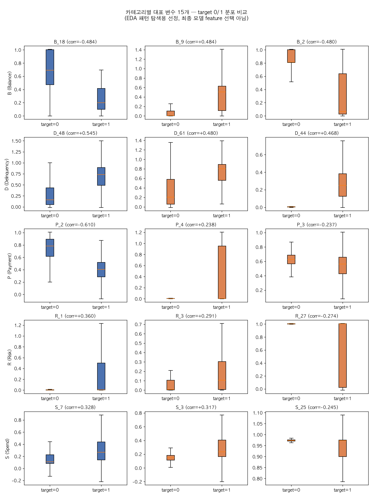

# Phase 2: EDA (탐색적 데이터 분석)

대상: `data/processed/train_sample_50k.parquet` (50,000명, 602,293행)
환경: 재부팅 후 여유 메모리 100~150MB대, DuckDB로만 집계 처리 (pandas 전체 로드 없음)
스크립트: [`scripts/phase2_class_imbalance.py`](../scripts/phase2_class_imbalance.py),
[`scripts/phase2_missingness_target.py`](../scripts/phase2_missingness_target.py),
[`scripts/phase2_feature_screening.py`](../scripts/phase2_feature_screening.py)

## 1. 클래스 불균형

- 원본과 샘플 모두 target=1(연체) 25.9% : target=0(정상) 74.1%, 약 2.9:1 — 극단적이지 않은 중간 수준 불균형
- Phase 4 모델링 시 `scale_pos_weight`/class_weight 조정 또는 threshold 튜닝으로 대응 가능한 수준 (원본 대비 샘플에서 비율 왜곡 없음, Phase 1에서 이미 확인)

## 2. 결측 자체가 target과 연관되는가 (50%+ 결측 30개 컬럼)

방법: 컬럼별 (결측 여부) x (target) 2x2 분할표 → 카이제곱검정 + phi 계수(연관 강도, 0~1). 표본이 커서(n=50,000) 카이제곱 p-value는 30개 전부 사실상 0에 가까워 통계적 유의성만으로는 변별력이 없음 → **phi 계수 크기**로 실질적 연관 강도를 판단.

phi ≥ 0.1(작다~중간 정도 연관)인 18개 컬럼:

| 컬럼 | phi | 결측률 (target=1) | 결측률 (target=0) | 방향 |
|---|---|---|---|---|
| B_17 | 0.333 | 27.9% | 66.1% | **역방향** (값이 있을수록 연체 위험↑) |
| R_26 | 0.266 | 74.0% | 93.5% | 역방향 |
| D_53 | 0.252 | 54.4% | 80.1% | 역방향 |
| D_42 | 0.236 | 71.4% | 90.5% | 역방향 |
| D_49 / D_132 / D_106 | 0.232~0.233 | 78.0~78.2% | 94.1~94.2% | 역방향 (세 컬럼 수치 거의 동일 — 파생/중복 관계 의심, Phase 3에서 상관 확인 필요) |
| **D_56** | 0.200 | 71.2% | 48.2% | **정방향** (결측일수록 연체 위험↑ — loan-default의 revol_util과 같은 패턴) |
| R_9 | 0.189 | 86.8% | 96.9% | 역방향 |
| D_134~D_138 (5개) | 0.158 | 91.4% | 98.2% | 역방향, 5개 수치 완전 동일 — 사실상 동일 결측 패턴 (한 그룹으로 취급 가능) |
| **D_50** | 0.138 | 68.6% | 52.7% | **정방향** |
| D_142 | 0.135 | 73.8% | 85.7% | 역방향 |
| D_105 | 0.118 | 44.2% | 57.8% | 역방향 |
| **D_76** | 0.117 | 95.3% | 86.8% | **정방향** |

**해석**:
- 대다수(18개 중 15개)는 **"역방향"** — 즉 target=1(연체) 그룹이 오히려 결측률이 *낮음* (값이 채워져 있음). 이는 loan-default 프로젝트에서 봤던 "결측=위험 신호" 패턴과 반대 방향. 가능한 해석: 이 30개 컬럼 다수가 D_(Delinquency) 계열로, "연체 이력/한도소진 관련 이벤트가 실제로 발생해야 값이 채워지는" 구조라면(예: 연체 발생 시점의 세부 항목), 연체 고객일수록 오히려 값이 존재할 수 있음 — Kaggle 데이터 자체가 익명화되어 있어 컬럼의 실제 의미는 알 수 없으므로 추정임.
- **D_56, D_50, D_76** 3개는 **"정방향"** — 결측일수록 연체 위험이 높은, loan-default의 revol_util과 유사한 패턴. Phase 3 feature engineering에서 이 3개는 "결측 여부" 자체를 binary indicator feature로 만들 우선순위가 높음.
- D_49/D_132/D_106, D_134~D_138처럼 수치가 거의 동일한 그룹은 서로 강한 상관관계(중복 정보)일 가능성이 커서 Phase 3에서 다중공선성 확인 필요.

## 3. 범주형 컬럼(D_63, D_64)의 target 연관성 (참고)

상관계수 스크리닝(§4)에서는 수치형이 아니라 제외됐지만, category별 target=1 비율 편차가 커서 카이제곱으로 별도 확인:

- **D_63** (6개 범주: CL/CO/CR/XL/XM/XZ): target=1 비율이 16.9%(CR) ~ 34.4%(XL)로 카테고리 간 최대 2배 차이. chi2=4,510, p≈0
- **D_64** (4개 범주 + 결측): target=1 비율이 O 16.9% ~ **결측 41.0%**로, 결측 자체가 4개 범주 중 가장 위험도가 높음 — D_64는 §2의 50%+ 결측 목록엔 없지만(전체 결측률은 낮음) 결측일 때의 위험도는 뚜렷함. chi2=24,370, p≈0

두 컬럼 모두 원-핫 인코딩 대상 후보로 Phase 3에서 검토.

## 4. 카테고리별 대표 변수 후보 (target과의 Pearson 상관 기준)

188개 feature를 D_(Delinquency)/S_(Spend)/P_(Payment)/B_(Balance)/R_(Risk) 5개 카테고리로 분류(컬럼 수: B 40, D 96, P 3, R 28, S 21) 후, 카테고리별로 target과의 상관계수 절대값 상위 3개를 뽑음.

> **주의**: 이 선정은 **EDA 단계에서 카테고리별 패턴을 빠르게 훑어보기 위한 선정**이며, Phase 4의 최종 모델 feature 선택과는 무관하다. 단순 Pearson 상관은 비선형 관계·다변량 상호작용을 반영하지 못하므로, 여기서 상관이 낮게 나온 변수도 최종 모델에서는 중요할 수 있다.

| 카테고리 | 1순위 | 2순위 | 3순위 |
|---|---|---|---|
| B (Balance, 40개) | B_18 (corr=-0.484) | B_9 (+0.484) | B_2 (-0.480) |
| D (Delinquency, 96개) | D_48 (+0.545) | D_61 (+0.480) | D_44 (+0.468) |
| P (Payment, 3개) | P_2 (-0.610, 최고 상관) | P_4 (+0.238) | P_3 (-0.237) |
| R (Risk, 28개) | R_1 (+0.360) | R_3 (+0.291) | R_27 (-0.274) |
| S (Spend, 21개) | S_7 (+0.328) | S_3 (+0.317) | S_25 (-0.245) |

전체 카테고리 중 가장 강한 단일 상관은 **P_2 (corr=-0.610)** — Payment 카테고리는 컬럼 수가 3개뿐인데도 가장 강력한 예측 신호를 보임 (아마 "최근 납부액/납부비율" 계열로 추정).

### 4.1 분포 시각화

(스크립트: [`scripts/phase2_representative_distributions.py`](../scripts/phase2_representative_distributions.py), 15개 컬럼만 DuckDB로 뽑아 pandas DataFrame화, peak RSS ~315MB)

- 15개 전부 target=0/1 간 중앙값·사분위 범위가 육안으로도 뚜렷이 갈림 — 상관계수 기준 선정이 실제로도 분리력 있는 변수들을 잘 뽑았음을 확인
- B_9, D_44, P_4, R_1, R_3 등 target=0 그룹이 0 근처에 강하게 몰려있고(하위 사분위=중앙값=0) target=1에서만 값이 퍼지는 패턴이 반복적으로 관찰됨 — "정상 고객은 해당 이벤트/한도소진이 아예 없고, 연체 고객만 값이 발생"하는 구조로 추정. §2에서 관찰한 결측 방향성(역방향 다수)과 같은 결의 패턴일 가능성이 있어 Phase 3에서 같이 검토할 만함
- **중복 의심 변수(D_49/D_132/D_106, D_134~D_138) 겹침 여부 확인**: 이번 15개 대표 변수 중 해당 컬럼과 겹치는 것은 **없음** (상관계수 기준 선정과 결측패턴 기준 중복 그룹은 서로 다른 컬럼 집합). 다중공선성에 대한 본격적인 검증(전체 188개 대상 상관행렬/VIF 등)은 Phase 3에서 진행 예정.

## 5. 시계열 활용 방향 — 옵션만 제시 (미결정)

13개월 관측 데이터를 Phase 3~4에서 어떻게 feature화할지에 대한 후보:

| 옵션 | 방법 | 장점 | 단점 |
|---|---|---|---|
| A. 최근 1개월 스냅샷 | 고객별 마지막 관측월 행만 사용 (cross-sectional) | 단순·빠름, 최신 상태 직접 반영, baseline 모델에 적합 | 추세/변화 정보 완전 손실, 관측 개월 수가 짧은 고객(13.6%)이 정보 손해를 더 보진 않음(어차피 1개월만 쓰므로) 하지만 "악화 추세"처럼 시간에 따른 신호를 놓침 |
| B. 월별 집계 통계량 파생 | 컬럼별 mean/std/min/max/last-first delta 등을 새 feature로 생성 | 표준 tabular 모델(XGBoost/LightGBM)에 바로 투입 가능, 추세 정보 보존, SHAP 해석 용이 | feature 수 급증(188 × 통계량 개수), 다중공선성 위험, engineering 공수 큼 |
| C. 최근 N개월 (예: 3개월) 요약 | 최근 N개월만 잘라 그 안에서 B와 동일하게 집계 | A와 B의 절충 — 최신성 + 단기 추세, feature 수 상대적으로 적음 | N 선택 기준이 다소 임의적 (교차검증으로 정할 수는 있음) |
| D. 시퀀스 모델 (RNN/LSTM/Transformer 등) | 13개월 시퀀스를 통째로 시퀀스 모델에 입력 | 시계열 패턴을 이론상 가장 풍부하게 활용 | 구현 복잡도 높음, padding/masking 등 전처리 추가 필요, SHAP 기반 해석(Phase 4 목표)과 궁합이 나쁨, 5만 표본 규모에서 과적합 위험, 프로젝트가 목표로 하는 "해석 가능한 신용위험 모델"이라는 포트폴리오 취지와 다소 안 맞을 수 있음 |

Phase 3 feature engineering 시작 시점에 다시 논의하고 결정하는 것을 제안 (지금은 결정하지 않음).
