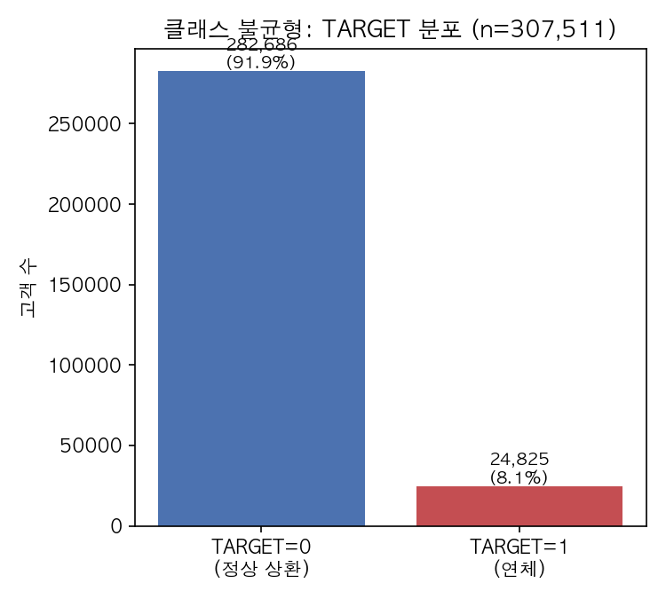

# Phase 2: EDA (Home Credit Default Risk)

대상: `data/raw/application_train.csv`(307,511행 × 122컬럼) + `data/processed/train_features_leanA.parquet`(Feature Engineering Option A 결과)
환경: 여유 메모리 64~100MB대, DuckDB로 CSV/Parquet 직접 처리 (pandas 전체 로드 없음)
스크립트: [`scripts/phase2_class_imbalance.py`](../scripts/phase2_class_imbalance.py), [`scripts/phase2_missingness_target.py`](../scripts/phase2_missingness_target.py), [`scripts/phase2_representative_distributions.py`](../scripts/phase2_representative_distributions.py), [`scripts/phase2_leanA_target_association.py`](../scripts/phase2_leanA_target_association.py)

## 1. 클래스 불균형

- TARGET=0(정상) 91.9% : TARGET=1(연체) 8.1%, **약 11.4:1**
- AMEX 프로젝트(25.9%, 약 2.9:1)보다 **훨씬 심한 불균형** — Phase 4 모델링 시 class_weight/scale_pos_weight 조정이 AMEX 때보다 더 중요해질 것으로 예상되고, 단순 accuracy는 의미가 거의 없어 AUC/PR-AUC 중심으로 평가해야 함

## 2. 결측률 높은 컬럼과 TARGET 연관성

- application_train 120개 feature 컬럼 중 **50%+ 결측 41개** (최대 69.9%, `COMMONAREA_AVG/MODE/MEDI`)
- 41개 중 상당수가 **건물/주거 특성 관련 변수**(공용면적, 엘리베이터 수, 벽 재질 등)이고, 동일 속성이 `_AVG`/`_MODE`/`_MEDI` 3개 버전으로 중복 존재 — 41개가 사실상 14개 내외의 독립 속성 × 3배임
- **phi 계수가 전부 매우 작음(최대 0.041)** — AMEX 때 최대 0.333이었던 것과 대조적. `phi>=0.05` 기준으로는 "뚜렷한 연관" 컬럼이 **0개**
- **해석**: 이 컬럼들은 외부 건물 등기 데이터 연계 실패로 인한 결측으로 보이며, 신용위험과 직접적 인과관계가 약한 것으로 판단됨. AMEX의 D_56처럼 "결측 자체가 위험 신호"인 패턴은 이번 데이터에서는 뚜렷하게 나타나지 않음 → Phase 3에서 이 41개 컬럼에 결측 indicator를 추가하는 우선순위는 낮게 잡아도 될 것으로 보임 (참고용, 최종 판단은 사용자 확인 후)

| 컬럼(상위 5) | 결측률 | phi | 결측률(TARGET=1) | 결측률(TARGET=0) |
|---|---|---|---|---|
| ENTRANCES_AVG/MODE/MEDI | 50.3% | 0.041 | 57.2% | 49.7% |
| ELEVATORS_AVG/MODE/MEDI | 53.3% | 0.040 | 60.1% | 52.7% |
| APARTMENTS_AVG/MODE/MEDI | 50.7% | 0.040 | 57.5% | 50.2% |

## 3. 주요 숫자형 변수의 TARGET별 분포

**중요 데이터 이슈 발견 — `DAYS_EMPLOYED` 이상치(anomaly)**: 이 컬럼 값이 **365243**(사람이 일할 수 없는 비현실적인 재직일수, 약 1000년)인 행이 **55,374건(전체 18%)** 존재. `NAME_INCOME_TYPE`과 교차 확인 결과 **Pensioner(은퇴자)의 99.98%**와 **Unemployed(무직) 100%**가 이 값을 가짐 — 즉 "고용되지 않음"을 나타내는 placeholder 값으로 확인됨(이 데이터셋에서 잘 알려진 이슈). 분포 시각화에서는 이 값을 제외하고 그렸음.

**처리 완료 (2026-08-22)**: [`scripts/_preprocessing.py`](../scripts/_preprocessing.py)에 `DAYS_EMPLOYED == 365243 → NULL` 치환 + `DAYS_EMPLOYED_ANOMALY`(True/False) 플래그 생성 로직을 추가하고, feature 생성 스크립트([`scripts/build_features_leanA.py`](../scripts/build_features_leanA.py)) 최종 join 단계 앞단에서 raw `application_train/test`에 이 전처리를 적용하도록 반영. `train_features_leanA.parquet`/`test_features_leanA.parquet` 재생성 후 `DAYS_EMPLOYED=365243` 잔존 0건 확인. 앞으로 만들 Option B(Full)도 이 전처리가 적용된 상태에서 시작한다.

- **AMT_INCOME_TOTAL(연소득), AMT_CREDIT(대출신청액)**: TARGET 그룹 간 중앙값 차이가 크지 않음 — 소득/신청액 자체보다 상환 능력 대비 부담(예: 소득 대비 신용 비율) 같은 파생지표가 더 예측력이 있을 가능성
- **DAYS_EMPLOYED(재직일수, anomaly 제외)**: TARGET=1(연체) 그룹의 중앙값이 약 -1,200일, TARGET=0(정상) 그룹은 약 -1,700일 — **연체 그룹이 재직 기간이 더 짧음** (신규 입사자일수록 위험 ↑, 직관적으로 타당한 신호)
- **DAYS_EMPLOYED anomaly 비율도 TARGET별로 다름**: TARGET=0에서 18.5%, TARGET=1에서 12.0% — **은퇴자/무직 상태가 오히려 연체 위험이 낮음** (연금 등 안정적 고정 수입 때문으로 추정) — 흥미로운 반직관적 신호

## 4. Feature Engineering(Option A) 파생 지표의 TARGET 연관성 검증

Phase 3에서 미리 만들어둔 bureau/previous_application 집계 지표들이 실제로 TARGET과 연관 있는지 확인.

**불리언 플래그**:
| 플래그 | 값 | TARGET=1 비율 | 표본 수 |
|---|---|---|---|
| has_bureau_record | False | **10.12%** | 44,020 |
| has_bureau_record | True | 7.73% | 263,491 |
| has_previous_application | False | 5.96% | 16,454 |
| has_previous_application | True | **8.19%** | 291,057 |

- `has_bureau_record=False`(신용조회 이력 없음, thin-file)일수록 위험↑ — 직관과 일치
- `has_previous_application=False`(Home Credit 이용 이력 없음)일수록 오히려 위험이 **낮음** — 다소 반직관적, 신규 고객 특성 차이로 추정(참고용)

**연속형 지표 (target과의 Pearson 상관, 절대값 상위)**:
| 지표 | corr | 해석 |
|---|---|---|
| ccb_utilization_mean_mean | **+0.144** | 신용카드 이용률 높을수록 위험↑ (가장 강한 신호, 도메인상 타당) |
| prev_refused_ratio | +0.078 | 과거 대출 거절 비율 높을수록 위험↑ |
| bureau_active_ratio | +0.077 | 활성 신용계좌 비율 높을수록 위험↑ |
| inst_late_frac_mean | +0.075 | 과거 상환 연체 비율 높을수록 위험↑ |
| prev_approved_ratio | -0.064 | 과거 승인 비율 높을수록 위험↓ |
| bureau_debt_credit_ratio | +0.061 | 부채/신용 비율 높을수록 위험↑ |

→ **Lean(A) feature들이 개별적으로는 상관이 크지 않아도(대부분 0.03~0.14) 방향성이 전부 도메인 직관과 일치** — 무작위 노이즈가 아니라 실제 신호를 담고 있음을 확인. Phase 4 모델링에서 이 지표들이 유의미하게 기여할 것으로 기대됨.

## 다음
- Option B(Full, 전체 통계량) 벤치마크 구현
