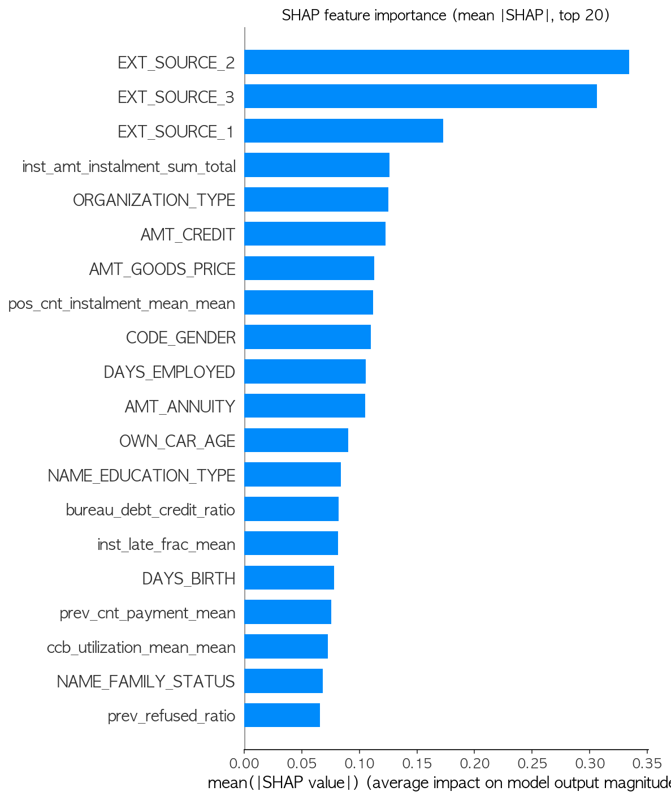
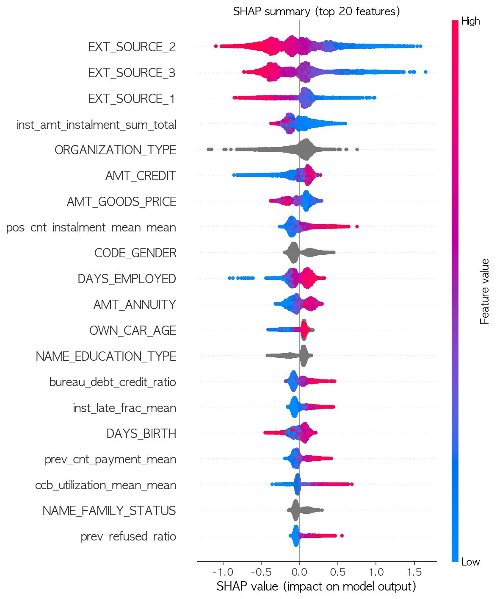

# Phase 4: 모델링 및 SHAP 해석

App-only / Lean(A) / Full(B) 3개 데이터셋 × LogisticRegression / RandomForest / XGBoost / LightGBM 4개 모델 비교.
스크립트: [`scripts/phase4_modeling.py`](../scripts/phase4_modeling.py) (비교), [`scripts/phase4_shap_analysis.py`](../scripts/phase4_shap_analysis.py) (SHAP)

방법: train/val 80/20 stratified split(random_state=42, 3개 데이터셋 공통). 불균형(TARGET 8.1%) 대응으로 LR/RF는 `class_weight='balanced'`, XGBoost/LightGBM은 `scale_pos_weight=11.39`(train 기준 음성/양성 비율). 범주형은 LR/RF용은 One-Hot Encoding(train에 fit, val은 transform만), XGBoost/LightGBM은 네이티브 categorical 지원 사용. Precision/Recall/F1은 임계값 0.5 기준. **이번 라운드는 하이퍼파라미터 튜닝 없는 1차 비교** — 본격 튜닝은 이후 라운드 과제.

이번 실행부터는 사용자 요청에 따라 메모리 모니터링을 하지 않음(문제 발생 시에만 보고).

## 결과 (12개 조합 전체)

| 데이터셋 | 모델 | ROC-AUC | Precision | Recall | F1 | 소요시간 |
|---|---|---|---|---|---|---|
| App-only | LogisticRegression | 0.6143 | 0.1119 | 0.5541 | 0.1861 | 72.8s |
| App-only | RandomForest | 0.7161 | 0.5333 | 0.0016 | 0.0032 | 17.6s |
| App-only | XGBoost | 0.7338 | 0.1856 | 0.5434 | 0.2767 | 5.8s |
| App-only | **LightGBM** | **0.7607** | 0.1734 | 0.6602 | 0.2746 | 4.4s |
| Lean(A) | LogisticRegression | 0.6346 | 0.1222 | 0.5319 | 0.1988 | 88.3s |
| Lean(A) | RandomForest | 0.7398 | 0.5000 | 0.0016 | 0.0032 | 21.9s |
| Lean(A) | XGBoost | 0.7489 | 0.2053 | 0.5196 | 0.2944 | 7.6s |
| Lean(A) | **LightGBM** | **0.7825** | 0.1888 | 0.6792 | 0.2954 | 6.1s |
| Full(B) | LogisticRegression | 0.6863 | 0.1364 | 0.6429 | 0.2251 | 155.2s |
| Full(B) | RandomForest | 0.7318 | 0.5000 | 0.0014 | 0.0028 | 46.6s |
| Full(B) | XGBoost | 0.7434 | 0.2108 | 0.4949 | 0.2956 | 19.8s |
| Full(B) | LightGBM | 0.7799 | 0.1898 | 0.6649 | 0.2952 | 16.7s |

## 중요 캐비어트 (결과를 있는 그대로 보고 발견한 문제)

### 1) RandomForest의 Recall이 사실상 0에 가까움 (0.0014~0.0016)
세 데이터셋 모두 RF는 ROC-AUC 자체는 0.71~0.74로 준수하지만, 임계값 0.5에서 거의 아무것도 "연체"로 예측하지 않음(Recall 0.16% 수준). `class_weight='balanced'`는 학습 시 손실 함수 가중치만 조정할 뿐, RF의 `predict_proba`(트리 투표 비율)가 로지스틱 계열 모델처럼 0.5 근처로 잘 보정(calibrated)되는 걸 보장하지 않기 때문 — 트리 다수가 여전히 다수 클래스로 투표해 확률이 낮게 나옴. **RF 자체가 나쁜 게 아니라 이 비교의 임계값 설정이 RF에는 안 맞는 것** — Phase 4 다음 라운드에서 RF는 최적 임계값을 별도로 찾거나(예: PR curve 기준) 애초에 이 비교에서 제외하는 걸 검토할 필요.

### 2) LogisticRegression이 수렴하지 않음 (ConvergenceWarning)
세 데이터셋 모두 `lbfgs` 솔버가 max_iter=1000 내에 수렴 못함 — feature 스케일을 안 맞춰서(예: AMT_CREDIT는 수십만 단위, 비율형 feature는 0~1) 발생한 것으로 보임. 소요시간도 유독 김(73~155초). **StandardScaler를 안 넣은 상태의 결과라 LR 성능(특히 AUC)이 실제보다 저평가됐을 가능성이 높음** — 다음 라운드에서 스케일링 추가 후 재검증 필요.

이 두 가지 모두 "1차 비교"의 한계로 문서에 정직하게 남기고, 결론(LightGBM 우세)에는 영향이 크지 않다고 판단함(LightGBM/XGBoost는 스케일에 영향받지 않는 트리 기반이라 이 캐비어트의 영향을 받지 않음).

## 결론: LightGBM이 4개 모델 중 일관되게 최고, Lean(A)가 최적 데이터셋

- **LightGBM이 3개 데이터셋 모두에서 최고 ROC-AUC** (0.76 / **0.78** / 0.78)
- **Lean(A) + LightGBM이 전체 12개 조합 중 최고(AUC 0.7825)** — Full(B)+LightGBM(0.7799)보다도 근소하게 높음. Phase 3 quick 벤치마크(5-fold CV, n_estimators 기본값)에서도 Lean(A)와 Full(B)가 거의 붙어있었는데(0.7764 vs 0.7800), 이번(단일 split, n_estimators=200)엔 순서가 오히려 뒤바뀜 — **"컬럼을 늘린다고 꾸준히 좋아지지는 않는다"는 결론이 재확인됨**
- → **최종 모델: Lean(A) + LightGBM** 선정. 애초 AMEX에서 Home Credit으로 전환한 이유("해석 가능한 feature 구조")와 성능 두 마리 토끼를 다 잡는 결과

## SHAP 분석 (Lean(A) + LightGBM)

`phase4_modeling.py`와 동일한 split/하이퍼파라미터로 재학습 후 `shap.TreeExplainer` 적용, validation set에서 5,000명 샘플링.

**상위 20개 feature (mean |SHAP|)**: `EXT_SOURCE_2` > `EXT_SOURCE_3` > `EXT_SOURCE_1` > `inst_amt_instalment_sum_total` > `ORGANIZATION_TYPE` > `AMT_CREDIT` > `AMT_GOODS_PRICE` > `pos_cnt_instalment_mean_mean` > `CODE_GENDER` > `DAYS_EMPLOYED` > `AMT_ANNUITY` > `OWN_CAR_AGE` > `NAME_EDUCATION_TYPE` > `bureau_debt_credit_ratio` > `inst_late_frac_mean` > `DAYS_BIRTH` > `prev_cnt_payment_mean` > `ccb_utilization_mean_mean` > `NAME_FAMILY_STATUS` > `prev_refused_ratio`

**해석**:
- **`EXT_SOURCE_1/2/3`(외부 신용평가 점수)가 압도적 1~3위** — Home Credit 데이터셋에서 잘 알려진 사실과 정확히 일치. 값이 높을수록(그림에서 빨간색) SHAP이 음수(위험↓) 방향으로 뚜렷하게 몰림 — 외부 신용점수가 실제로 강한 보호 요인
- **Phase 3에서 만든 Lean(A) 파생 지표들이 상위 20개 중 7개**(`inst_amt_instalment_sum_total`, `pos_cnt_instalment_mean_mean`, `bureau_debt_credit_ratio`, `inst_late_frac_mean`, `prev_cnt_payment_mean`, `ccb_utilization_mean_mean`, `prev_refused_ratio`)를 차지 — application 원본 변수뿐 아니라 우리가 직접 설계한 신용이력 요약 feature들도 실제로 강한 신호를 담고 있음이 재확인됨
- **방향성이 Phase 2 EDA에서 확인한 상관관계와 정확히 일치**: `bureau_debt_credit_ratio`, `inst_late_frac_mean`, `prev_refused_ratio` 모두 값이 높을수록(빨간색) SHAP이 양수(위험↑) — Phase 2 §4에서 확인한 Pearson 상관 방향과 동일
- `AMT_CREDIT`, `AMT_GOODS_PRICE`, `AMT_ANNUITY` 등 대출 규모 관련 변수와 `DAYS_EMPLOYED`(재직일수), `DAYS_BIRTH`(연령)도 예상대로 중요 변수로 확인됨

## 다음
- LR 스케일링 반영 재검증, RF 임계값 재검토 (1차 비교의 한계 보완)
- 필요시 Lean(A) + LightGBM 하이퍼파라미터 튜닝 (Optuna 등)
- Phase 5: FastAPI 서빙 준비
